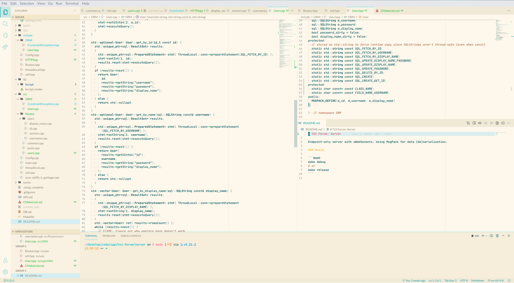
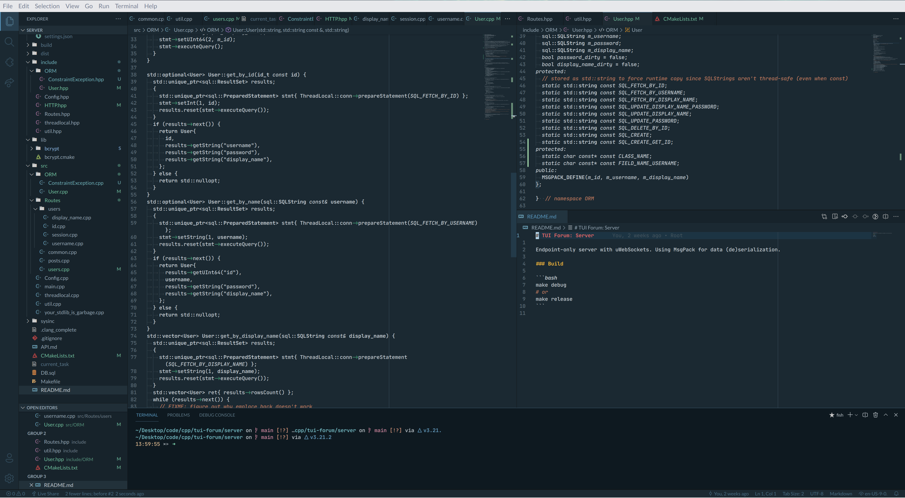

# VS Code Theme




This theme is a derivative of [Noctis](https://github.com/liviuschera/noctis). It is modified to embrace semantic rather than syntactic highlighting.

Make sure you install the JetbrainsMono Nerd Font Mono font, otherwise your editor will probably fall back to a proportional font and look really ugly. You can get it here: <https://github.com/ryanoasis/nerd-fonts/tree/master/patched-fonts/JetBrainsMono/Ligatures>

## Companions

- Rainbow CSV
- Fluent Icons
- File Icons
- The following additions to `settings.json`:

```json
	"editor.tokenColorCustomizations": {
		"textMateRules": [
			{
				"scope": "heading.1.markdown entity.name.section.markdown, heading.1.markdown punctuation.definition.heading.markdown",
				"settings": {
					"foreground": "#e66767",
				}
			},
			{
				"scope": "heading.2.markdown entity.name.section.markdown, heading.2.markdown punctuation.definition.heading.markdown",
				"settings": {
					"foreground": "#f19066",
				}
			},
			{
				"scope": "heading.3.markdown entity.name.section.markdown, heading.3.markdown punctuation.definition.heading.markdown",
				"settings": {
					"foreground": "#f6b93b",
				}
			},
			{
				"scope": "heading.4.markdown entity.name.section.markdown, heading.4.markdown punctuation.definition.heading.markdown",
				"settings": {
					"foreground": "#78e08f",
				}
			},
			{
				"scope": "heading.5.markdown entity.name.section.markdown, heading.5.markdown punctuation.definition.heading.markdown",
				"settings": {
					"foreground": "#546de5",
				}
			},
			{
				"scope": "heading.6.markdown entity.name.section.markdown, heading.6.markdown punctuation.definition.heading.markdown",
				"settings": {
					"foreground": "#574b90",
				}
			}
		]
	},
	"workbench.colorCustomizations": {
		"editorError.foreground": "#E3879E",
	},
	"workbench.productIconTheme": "fluent-icons",
	"workbench.iconTheme": "file-icons",
	"editor.fontFamily": "\"JetbrainsMono Nerd Font Mono\"",
	"editor.fontLigatures": true,
	"editor.renderWhitespace": "boundary",
	"editor.rulers": [
		79,
		160
	],
	"editor.fontWeight": 500,
	"terminal.integrated.fontWeight": 500,
	"terminal.integrated.fontWeightBold": 700,
	"editor.fontSize": 13,
	"terminal.integrated.fontSize": 13,
	"terminal.integrated.lineHeight": 1.1,
	"workbench.tree.renderIndentGuides": "always",
	"workbench.tree.indent": 9.5,
	"editor.lineNumbers": "relative",
	"editor.cursorStyle": "line",
	"editor.wordWrap": "on",
	"editor.wrappingIndent": "indent",
	"window.zoomLevel": -1,
```

I also use Sundial to switch between light and dark themes automatically, with the following config:

```json
	"workbench.preferredDarkColorTheme": "MattTheme Dark",
	"workbench.preferredLightColorTheme": "MattTheme Light",
	"sundial.sunset": "21:00",
	"sundial.sunrise": "06:30",
```
